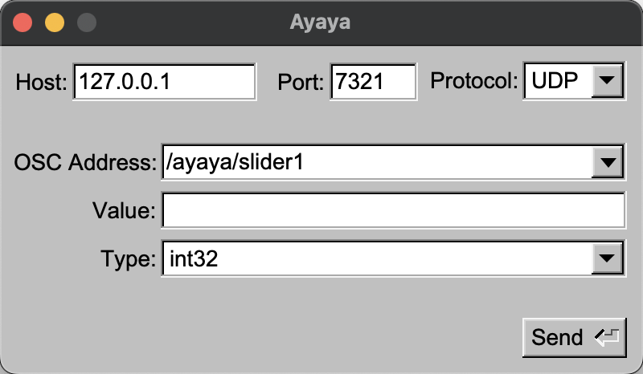

# Ayaya

This is a simple and small tool to send some messages via the [Open Sound Control protocol](http://opensoundcontrol.org). You can use it to test out some OSC interfaces quickly.
It may not include a lot of features, but it is quite handy for myself. Feel free to contribute more features if you need them.

## Building

On Linux systems, you need to install some dependencies for FLTK first. This is the appropriate command for an Ubuntu-based system:
```bash
sudo apt-get install -y libpango1.0-dev libx11-dev libxext-dev libxft-dev libxinerama-dev libxcursor-dev libxrender-dev libxfixes-dev libpng-dev
```

After that, it's just a regular build with Cargo.
```bash
cargo build --release
```

You will find the executable called `ayaya` within `target/release/`.

Using [cargo-bundle](https://github.com/burtonageo/cargo-bundle), you can also create an OS-specific app bundle (e.g. for macOS) with:
```bash
cargo bundle --release
```

## Usage

If you open the application, you should be presented with this main window:


This allows you to send an OSC message to a receiver of your choice. Enter the destination in the first line, then add the OSC address, the value to send and the data type of the value entered.
Currently, only the following OSC data types are supported:
* int32
* float32
* OSC-string

When you're done, click send (or hit the enter key) and your message will be sent.

## Contributors

- [Hannes Braun](https://github.com/hannesbraun) - creator and maintainer

## License

Copyright (c) 2021-2022, Hannes Braun

Ayaya is licensed under the Boost Software License 1.0. For more information, see [LICENSE](LICENSE).
